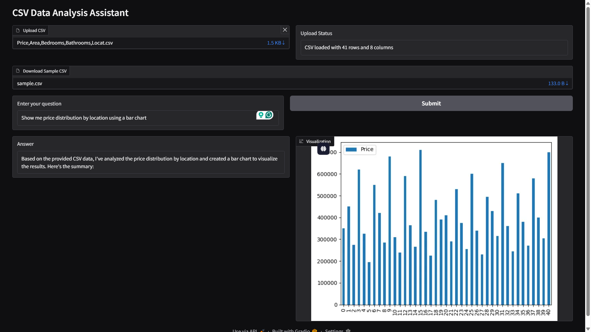

# CSV Data Analysis Assistant

A Gradio-based application for natural language querying of CSV data and automated visualization using local LLMs (Llama 3 via Ollama).



## Features

- **CSV File Handling**  
  Upload and validate CSV files (up to 25MB)
- **Natural Language Queries**  
  Ask questions in plain English about your data
- **Automated Visualization**  
  Generate scatter plots, histograms, bar charts, and line graphs
- **Local AI Processing**  
  Uses Llama 3 8B model running locally via Ollama
- **Multi-Feature Support**  
  Handles both numerical and categorical data analysis

## Installation

### Prerequisites
- Python 3.9+
- Ollama (local LLM server)
- 8GB+ RAM recommended

### Steps

1. **Install Ollama**  
   [Download Ollama](https://ollama.ai/download) and install for your OS

2. **Set Up Python Environment**
   ```bash
   git clone https://github.com/Decimator003/Cardekho.git
   cd Cardekho
   python -m venv venv
   source venv/bin/activate  # Linux/Mac
   .\venv\Scripts\activate  # Windows
   pip install -r requirements.txt

3. **Download Llama 3 8B Model**
   ```bash
   ollama pull llama3:8b-instruct-q4_K_M

### Usage

1. **Start Ollama Server**

    ```bash
    # Terminal 1 - Ollama Server
    ollama serve

    # Terminal 2 - Application
    python app.py

2. **Access the Interface**
   Open your web browser and navigate to `http://localhost:7860`

3. **Workflow**
   - Upload a CSV file
   - Ask a question about your data like:
   "What is the average price of cars in the dataset?"
    "How many cars are there in the dataset?"

### Sample Dataset

Use the included `sample.csv` dataset for testing. It contains 50 entries such as:
- `Price`
- `Area(sq ft)`
- `Bedrooms`
- `Bathrooms`
- `Location`
- `Year Built`
- `Garage`
- `Stories`

### Technical Stack
- **Framework**: Gradio (UI)
- **Data Processing**: Pandas
- **LLM**: Ollama (Llama 3 8B)
- **Visualization**: Matplotlib
- **Validation**: Pydantic